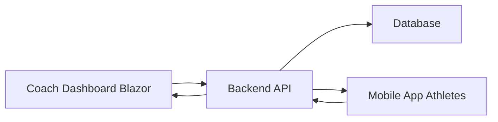

# LockIn

> [!NOTE]
> ## Development Status
>
> This project is currently active, but the **coach features are temporarily on hold**.
>
> I’m currently focusing on the **self-directed athlete experience**, which is the main priority of the product. This comes from a personal need, as I haven’t found any existing solution that properly fits this use case without unnecessary complexity.

## Badges

---

## Overview

**LockIn** is a training-tracking app built first and foremost for the **self-directed athlete**, with an optional extension toward a coached experience.

* In **self-coached mode**, the athlete creates and manages their own training program, and tracks their progress session after session, with no dependency on a coach.
* In **coached mode**, the athlete follows the program set by their coach, and their activity data is automatically sent back to them.

The project is part of a broader ecosystem made up of:

* A backend **API**
* A centralized **database**
* A **mobile application** for athletes
* A **Blazor dashboard** for coaches (currently on hold)

The goal is to offer a simple, effective tool for tracking training day to day, whether self-directed or coached, without the unnecessary complexity of existing solutions.

---

## System Architecture

### Backend API

Responsible for:

* Business logic
* Authentication & authorization
* Data processing
* Communication between clients

### Database

Stores:

* Users (coaches & athletes)
* Training programs
* Exercises
* Activity logs

### Mobile Application (Athletes)

Self-coached athletes:

* Create and manage their own training programs
* Track workouts and performance
* Log training sessions easily

Coached athletes:

* View assigned programs from their coach
* Follow structured training plans
* Track workouts as prescribed
* Send activity data back to the coach

### Coach Dashboard

Used by coaches to:

* Manage athletes and training content
* Create and assign programs
* Analyze performance
* Get a global overview of athlete activity

---

## Architecture Diagram

---

## Project Organization

This project is developed as a personal application.

Features are added progressively based on product owner feedback and evolving needs. There is no fixed roadmap or delivery deadline.

The goal is to keep the development flexible and lightweight while maintaining a clean and structured codebase. Even if the project is built in a relaxed, non-commercial context, the architecture and implementation are kept organized, readable, and easy to maintain over time.

The focus is mainly on:
- Delivering functional features step by step
- Keeping the codebase clean and consistent
- Avoiding unnecessary complexity
- Adapting quickly to new requirements
