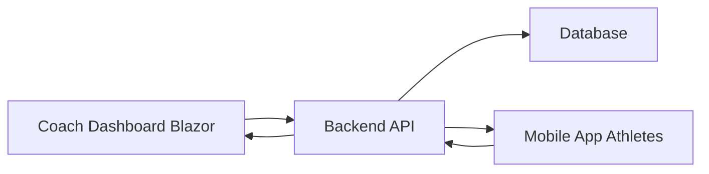

# Coach Dashboard (Blazor)

## Badges

---

## Overview

The **Coach Dashboard** is a web application built with **Blazor** as part of a larger coaching ecosystem.
It represents the **coach-facing interface** of a broader system composed of:

* A backend **API**
* A centralized **database**
* A **mobile application** for athletes
* This **Blazor dashboard** for coaches

The goal is to provide a functional and intuitive tool for coaches to manage athletes, programs, and training content while maintaining a global view of athlete activity.

---

## Purpose

This application allows coaches to:

* Manage athletes (profiles, status, progression)
* Create and organize exercises
* Build and assign training programs
* Track athlete activity and adherence
* Monitor performance and long-term evolution

It centralizes coaching operations into a single platform while ensuring consistency across mobile and backend systems.

---

## System Architecture

### Backend API

Responsible for:

* Business logic
* Authentication & authorization
* Data processing
* Communication between clients

### Database

Stores:

* Users (coaches & athletes)
* Training programs
* Exercises
* Activity logs

### Mobile Application (Athletes)

Used by athletes to:

* View assigned programs
* Track workouts
* Follow coach instructions
* Send activity data

### Coach Dashboard (Blazor) — *this repository*

Used by coaches to:

* Manage athletes and training content
* Create and assign programs
* Analyze performance
* Get a global overview of athlete activity

---

## Architecture Diagram

---

## Project Organization

This project is developed as a personal, iterative application.

Features are added progressively based on product owner feedback and evolving needs. There is no fixed roadmap or delivery deadline.

The goal is to keep the development flexible and lightweight while maintaining a clean and structured codebase. Even if the project is built in a relaxed, non-commercial context, the architecture and implementation are kept organized, readable, and easy to maintain over time.

The focus is mainly on:
- Delivering functional features step by step
- Keeping the codebase clean and consistent
- Avoiding unnecessary complexity
- Adapting quickly to new requirements

---

## Product Ownership

**Product Owner:**
Coach Kek's — [His instagram](https://www.instagram.com/coach_keks/)

---
